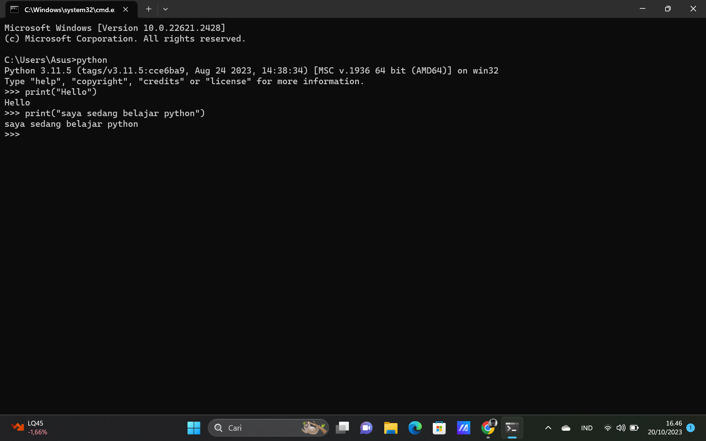

# latihan-python

<h1>LANGKAH LANGKAH</h1>

pertama buatlah repository server

kemudian clone repository (git clone [url repository])

cd (nama repository)

git add (nama folder)

git commit -m ("nama folder")

git push -u origin main

<h1>LATIHAN 1</h1>

<h1>LATIHAN 2</h1>

<h1>LATIHAN 3</h1>

